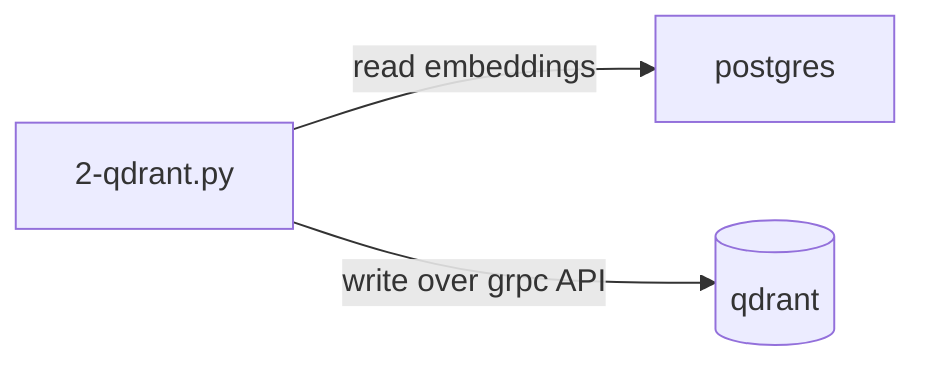
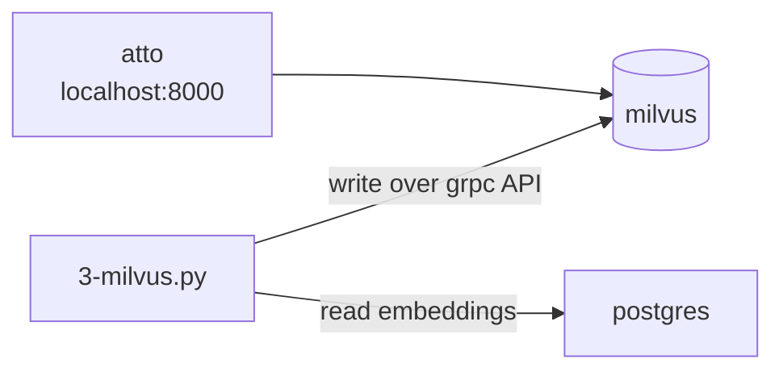

## Vector DBs comparison sandbox on a Biblical multilingual 10M verses

Goal of this repo is to compare different vector databases in terms of performance, load,
ease of use and features.

https://github.com/user-attachments/assets/a622727e-deb7-4b55-95e2-0642bd6f4763

## Candidates & Results

Most of time is spent on embedding generation (days)
Note that insertion also includes md5 hash generation.

| Nr | Engine                                                                 | Ports                                                                           | UI | Insert speed<br>(avg on 1k batch) | Search 21k rows | Search ~1M rows      | Ease of integration 🤯 | Storage of 1.4M rows |
|----|------------------------------------------------------------------------|---------------------------------------------------------------------------------|----|-----------------------------------|-----------------|----------------------|------------------------|----------------------|
| 2  | [Qdrant 1.11.0](https://github.com/qdrant/qdrant)                      | 6334 [6333](http://localhost:6333/dashboard#/collections)                       | 🟡 | 🟢 0.129 sec -> 0.25 sec          | 🟢 0.008 sec    | 🟡0.119 sec @ 920k   | ★★★★☆                  | 🟢 3.21 GB           |
| 5  | [Weviate 1.24.22](https://github.com/weaviate/weaviate)                | [8080](http://localhost:8080/v1/schema/Collection_768?_with_meta_count=1) 50051 | 🔴 | 🟡 0.411 sec -> 2 sec             | 🟢 0.006 sec    | 🟢0.010 sec @ 1.4M   | ★★★☆☆                  | 🟢 8.41 GB           |
| 7  | [ChromaDB 0.5.5](https://github.com/chroma-core/chroma)                | 8000                                                                            | 🔴 | 🔴 1.21 sec -> 4 sec              | 🟢 0.018 sec    | 🟢 0.022 sec @ 1.4M  | ★★★★☆                  | 🟡 12.37 GB          |
| 3  | [Milvus 2.4.8](https://github.com/milvus-io/milvus)                    | 9091 19530 [8000](http://localhost:8000)                                        | 🟢 | 🟢 0.118 sec -> 0.4 sec           | 🔴 0.234 sec    | 🟡0.388 sec @ 683k;  | ★★★☆☆                  | 🔴 34.25 GB          |
| 1  | Postgres 16.4 + [pgvector 0.7.4](https://github.com/pgvector/pgvector) | 5432                                                                            | 🟡 | --                                | 🟡 0.069 sec    | 🔴 22.566 sec @ 1.4M | ★★☆☆☆                  | 🟡 11.2 GB           |
| 4  | [Redis stack 7.4](https://github.com/redis/redis)                      | 6379 [8001](http://localhost:8001/)                                             | 🟢 | 🔴 1.353 sec -> 4 sec             | 🟡 0.044 sec    | N/A                  | ★★☆☆☆                  | N/A                  |
| 6  | [Elastic 8.15](https://github.com/elastic/elasticsearch)               | [5601](http://localhost:5601/app/home#/) 9200                                   | 🟢 | 🔴 2.917 sec                      | 🟢 0.008 sec    | --                   | ★★★☆☆                  | 🔴 17.2 GB           |

I don't take into account cloud-only solutions like 
[Pinecone](https://docs.pinecone.io/guides/get-started/quickstart), [MongoDB Atlas](https://www.mongodb.com/docs/atlas/getting-started/)

### Testing Approach
Used: 
- 💻 Mac M3 36GB RAM (Nov 2023), Sonoma 14.1. On your machine, you likely will get different result. Goal is to compare engines between each other on the same machine.
- 🐍 python 3.11 was used to run test scripts that move the data
  - I tried to measure API time, not the time it takes to generate embeddings 
- 🐳 docker with 6 CPU and 12.8GB RAM global limits, no per-container limits
  - single-container dockerized vector databases
  - While testing, only postgres container (as source) and vector-DB-under-test containers were running to reduce potential CPU and I/O interference
- Basic test is to load bible text data and compare search performance
  - I did not use external (OpenAI) APIs for embeddings, but even so, multilingual model for embedding generation was very slow. Thats why I stored it in postgres to not do it in runtime while doing inserts
  - For 21k dataset, I used `WHERE translationId = 'rus_syn'` to filter out data from postgres that had embeddings. Goal is to see how engines perform initially
  - For 1.4M dataset I just used rows that had embeddings in postgres by that time. Goal is to test larger scales of data that engine may see in production and how it degrades
- I tried to use Cosine similarity with HNSW

### Data preparation

- Download SQLite data for bible in different languages
  https://bible.helloao.org/bible.db (8.4GB)
- Export `ChapterVerse` from SQLIte to Postgres for better performance. You will need some tool like IntelliJ DataGrip.
  You could use sqlite but it would be very slow.
- Add column `ChapterVerse.embedding` with `store.vector(768)` type
- Create index in postgres for faster updates


```
  create index ChapterVerse_translationid_bookid_chapternumber_number_index
    on store."ChapterVerse" (translationid, bookid, chapternumber, number);
  ```

- Pre-Generate embeddings and store them in same `ChapterVerse`.
  Use multilingual embed model with **768 dim**.
  https://huggingface.co/sentence-transformers/paraphrase-multilingual-mpnet-base-v2

- Spin up vector database you want to test

```
# https://huggingface.co/sentence-transformers/paraphrase-multilingual-mpnet-base-v2
pip install -U sentence-transformers


# Generate embeddings into SQLite
# This will take a while
# You can re-run it to continue from where it stopped
python 0-generate-embeddings.py
```

### 1. Postgres + pgvector
- ✅ Data is stored in Postgres, so no need to sync data between databases
- 🟡 No specialized UI, but you can reuse postgres-specific ones
- 🟡 Mediocre search on small dataset
- 🟡 Operators are not the most intuitive
- 🟡 Limited activity / community
- ❌ Slowest search on large dataset
- ❌ could not install pgvector on Postgres 14 and 15, only version 16 worked
- ❌ faced `psycopg2.errors.UndefinedFunction: operator does not exist: text <-> vector` when installing extension because
  operators were installed into public schema instead of `store`. Had to reset the image and set extension installation under `store` schema.


```
docker-compose -f docker-compose.pgvector.yml up postgres --build
python -m pip install "psycopg[binary]"
python 1-pgvector.py
```

<details>
<summary>Postgres similarity results on 24k dataset</summary>

```
Text: чтобы достигнуть воскресения мертвых.; Similarity: 0.9226886199645554
Text: Но Бог воскресил Его из мертвых.; Similarity: 0.8717796943695277
Text: а Начальника жизни убили. Сего Бог воскресил из мертвых, чему мы свидетели.; Similarity: 0.8707684267530202
Text: Но Христос воскрес из мертвых, первенец из умерших.; Similarity: 0.86272182337587
Text: Так и при воскресении мертвых: сеется в тлении, восстает в нетлении;; Similarity: 0.8626047520415614
Text: и что Он погребен был, и что воскрес в третий день, по Писанию,; Similarity: 0.8371098014647679
Text: Ибо как смерть через человека, так через человека и воскресение мертвых.; Similarity: 0.8319413838804383
Text: которою Он воздействовал во Христе, воскресив Его из мертвых и посадив одесную Себя на небесах,; Similarity: 0.8282566644099042
Text: и гробы отверзлись; и многие тела усопших святых воскресли; Similarity: 0.8217248023128517
Text: быв погребены с Ним в крещении, в Нем вы и совоскресли верою в силу Бога, Который воскресил Его из мертвых,; Similarity: 0.8162701932003219
```
</details>

<details>
<summary>Postgres similarity results on 1M dataset</summary>

```
Text: a fin de llegar a la resurrección de entre los muertos.; Similarity: 0.942152166206366
Text: чтобы достигнуть воскресения мертвых.; Similarity: 0.9226886199645554
Text: që në ndonjë mënyrë të mund t’ia arrij ringjalljes prej së vdekurish.; Similarity: 0.9156135526648216
Text: om eenmaal te kunnen komen tot de opstanding uit de doden.; Similarity: 0.9023653865460769
Text: щоб таким чином якось досягти воскресіння з мертвих.; Similarity: 0.9002284663817843
Text: si en alguna manera llegase a la resurrección de los muertos.; Similarity: 0.8967561370447131
Text: अपरं स्मुर्णास्थसमिते र्दूतं प्रतीदं लिख; य आदिरन्तश्च यो मृतवान् पुनर्जीवितवांश्च तेनेदम् उच्यते,; Similarity: 0.8730900101269639
Text: Но Бог воскресил Его из мертвых.; Similarity: 0.8717796943695277
Text: а Начальника жизни убили. Сего Бог воскресил из мертвых, чему мы свидетели.; Similarity: 0.8707684267530202
Text: abych [tak] snad dospěl ke vzkříšení z mrtvých.; Similarity: 0.8700215089349997
```
</details>


#### How to visualize embeddings

You can use [cosmograph](https://cosmograph.app/run/)  online tool to visualize nodes and edges.

<details>
<summary>Exporting data for visualization</summary>

Export nodes into CSV:

```sql
SELECT CONCAT(translationid, '-', bookid, '-', chapternumber, '-', number) as id,
       text                                                                as label
FROM store."ChapterVerse"
WHERE embedding IS NOT NULL
  AND translationId = 'rus_syn'
  AND bookid IN ('JHN', 'LUK', 'MRK', 'MAT') LIMIT 10000;
```

Export edges into CSV:

```sql
SET
search_path TO store;
WITH pairwise_similarity
         AS (SELECT CONCAT(t1.translationid, '-', t1.bookid, '-', t1.chapternumber, '-', t1.number) AS source,
                    CONCAT(t2.translationid, '-', t2.bookid, '-', t2.chapternumber, '-', t2.number) AS target,
                    1 - (t1.embedding <=> t2.embedding)                                             AS similarity
             FROM store."ChapterVerse" t1,
                  store."ChapterVerse" t2
             WHERE t1.bookid IN ('JHN', 'LUK', 'MRK', 'MAT')
               AND t2.bookid IN ('JHN', 'LUK', 'MRK', 'MAT')
               AND t1.translationId = 'rus_syn'
               AND t2.translationId = 'rus_syn'
               AND t1.embedding IS NOT NULL
               AND t2.embedding IS NOT NULL
               AND CONCAT(t1.translationid, '-', t1.bookid, '-', t1.chapternumber, '-',
                          t1.number) != CONCAT(t2.translationid, '-', t2.bookid, '-', t2.chapternumber, '-', t2.number)
    )
SELECT source,
       target,
       similarity AS weight
FROM pairwise_similarity
WHERE similarity > 0.95
ORDER BY weight DESC LIMIT 10000;

```
</details>

### 2. Qdrant

- ✅ very clear API and docs
- ✅ fast search
- ✅ built-in index creation at collection setup
- ✅ has no-wait / async indexing
- ✅ good community & PR activity
- 🟡 has built-in UI with, but you need to type to search; has embedding visualization
- 🟡 required entry to have `id`
- ❌ Failing on starting `ERROR qdrant::startup: Panic occurred in file /qdrant/lib/collection/src/shards/replica_set/mod.rs at line 277: Failed to load local shard "./storage/collections/collection_768/0": Service internal error: Not a directory (os error 20)`
- ❌ Failed at 920k, possibly related to docker?
```
grpc._channel._InactiveRpcError: <_InactiveRpcError of RPC that terminated with:
	status = StatusCode.UNAVAILABLE
	details = "failed to connect to all addresses; last error: UNKNOWN: ipv4:0.0.0.0:6334: Failed to connect to remote host: connect: Connection refused (61)"
	debug_error_string = "UNKNOWN:Error received from peer  {grpc_message:"failed to connect to all addresses; last error: UNKNOWN: ipv4:0.0.0.0:6334: Failed to connect to remote host: connect: Connection refused (61)", grpc_status:14, created_time:"2024-08-22T04:34:22.315805+03:00"}"
>
```




```
docker-compose -f docker-compose.qdrant.yml up qdrant

python -m pip install 'qdrant-client'

# Test Qdrant
python 2-qdrant.py
```


<details>
<summary>Qdrant similarity results on 21k dataset</summary>

```
Text: чтобы достигнуть воскресения мертвых.; Similarity: 0.9226888418197632
Text: Но Бог воскресил Его из мертвых.; Similarity: 0.8717798590660095
Text: а Начальника жизни убили. Сего Бог воскресил из мертвых, чему мы свидетели.; Similarity: 0.8707683682441711
Text: Но Христос воскрес из мертвых, первенец из умерших.; Similarity: 0.8627219200134277
Text: Так и при воскресении мертвых: сеется в тлении, восстает в нетлении;; Similarity: 0.8626047968864441
Text: и что Он погребен был, и что воскрес в третий день, по Писанию,; Similarity: 0.8371099233627319
Text: Ибо как смерть через человека, так через человека и воскресение мертвых.; Similarity: 0.8319414258003235
Text: которою Он воздействовал во Христе, воскресив Его из мертвых и посадив одесную Себя на небесах,; Similarity: 0.8282566666603088
Text: и гробы отверзлись; и многие тела усопших святых воскресли; Similarity: 0.8217248916625977
Text: быв погребены с Ним в крещении, в Нем вы и совоскресли верою в силу Бога, Который воскресил Его из мертвых,; Similarity: 0.8162703514099121
```
</details>

<details>
<summary>Qdrant similarity results on 920k dataset</summary>

```
Text: του ορισθεντος υιου θεου εν δυναμει κατα πνευμα αγιωσυνης εξ αναστασεως νεκρων ιησου χριστου του κυριου ημων; Similarity: 0.8435215950012207
Text: которою Он воздействовал во Христе, воскресив Его из мертвых и посадив одесную Себя на небесах,; Similarity: 0.8282566666603088
Text: которою Он воздействовал во Христе, воскресив Его из мертвых и посадив одесную Себя на небесах,; Similarity: 0.8282566666603088
Text: in der er gewirkt hat in dem Christus, indem er ihn aus den Toten auferweckte; (und er setzte ihn zu seiner Rechten in den himmlischen Örtern,; Similarity: 0.8242398500442505
Text: in der er gewirkt hat in dem Christus, indem er ihn aus den Toten auferweckte; (und er setzte ihn zu seiner Rechten in den himmlischen Örtern,; Similarity: 0.8242398500442505
Text: 死而复生所展现的惊人能力。上帝在天上将基督安置在他的右手边，; Similarity: 0.8202930688858032
Text: 死而复生所展现的惊人能力。上帝在天上将基督安置在他的右手边，; Similarity: 0.8202930688858032
Text: 死而复生所展现的惊人能力。上帝在天上将基督安置在他的右手边，; Similarity: 0.8202930688858032
Text: Koju uèini u Hristu, kad ga podiže iz mrtvijeh i posadi sebi s desne strane na nebesima,; Similarity: 0.8188406229019165
Text: که درمسیح عمل کرد چون او را از مردگان برخیزانید وبه‌دست راست خود در جایهای آسمانی نشانید،; Similarity: 0.8181155920028687```
```
</details>

### 3. Milvus
- ✅ Docs look impressive
- ✅ good community & PR activity
- 🟡 Has concept of "loading" and unloading a collection (from memory)
- 🟡 Takes ~20 sec to start up (compared to others)
- 🟡 Milvus does not come with built-in UI, so we use `attu` for that.
- 🟡 Has extra containers
- ❌ Search was slow, even though it used an index (maybe I did something wrong?)
- ❌ Failed at insertion @ 683k
```pymilvus.exceptions.MilvusException: <MilvusException: (code=<bound method _MultiThreadedRendezvous.code of <_MultiThreadedRendezvous of RPC that terminated with:
	status = StatusCode.UNAVAILABLE
	details = "failed to connect to all addresses; last error: UNKNOWN: ipv4:127.0.0.1:19530: Failed to connect to remote host: connect: Connection refused (61)"
	debug_error_string = "UNKNOWN:Error received from peer  {grpc_message:"failed to connect to all addresses; last error: UNKNOWN: ipv4:127.0.0.1:19530: Failed to connect to remote host: connect: Connection refused (61)", grpc_status:14, created_time:"2024-08-22T04:07:48.480463+03:00"}"
>>, message=Retry run out of 75 retry times, message=failed to connect to all addresses; last error: UNKNOWN: ipv4:127.0.0.1:19530: Failed to connect to remote host: connect: Connection refused (61))>
```



```bash
python -m pip install pymilvus
docker-compose -f docker-compose.milvus.yml up
```


<details>
<summary>Milvus similarity results on 21k dataset</summary>

```
Text: чтобы достигнуть воскресения мертвых.; Similarity: 0.9226888418197632
Text: Но Бог воскресил Его из мертвых.; Similarity: 0.8717797994613647
Text: а Начальника жизни убили. Сего Бог воскресил из мертвых, чему мы свидетели.; Similarity: 0.8707685470581055
Text: Но Христос воскрес из мертвых, первенец из умерших.; Similarity: 0.8627219796180725
Text: Так и при воскресении мертвых: сеется в тлении, восстает в нетлении;; Similarity: 0.8626042604446411
Text: и что Он погребен был, и что воскрес в третий день, по Писанию,; Similarity: 0.8371096253395081
Text: Ибо как смерть через человека, так через человека и воскресение мертвых.; Similarity: 0.831940770149231
Text: которою Он воздействовал во Христе, воскресив Его из мертвых и посадив одесную Себя на небесах,; Similarity: 0.8282568454742432
Text: и гробы отверзлись; и многие тела усопших святых воскресли; Similarity: 0.8217248320579529
Text: быв погребены с Ним в крещении, в Нем вы и совоскресли верою в силу Бога, Который воскресил Его из мертвых,; Similarity: 0.8162701725959778
```
</details>

<details>
<summary>Milvus similarity results on 814k dataset</summary>

```
Text: чтобы достигнуть воскресения мертвых.; Similarity: 0.9226888418197632
Text: Но Бог воскресил Его из мертвых.; Similarity: 0.8717797994613647
Text: Но Бог воскресил Его из мертвых.; Similarity: 0.8717797994613647
Text: а Начальника жизни убили. Сего Бог воскресил из мертвых, чему мы свидетели.; Similarity: 0.8707685470581055
Text: Но Христос воскрес из мертвых, первенец из умерших.; Similarity: 0.8627219796180725
Text: и что Он погребен был, и что воскрес в третий день, по Писанию,; Similarity: 0.8371096253395081
Text: Ибо как смерть через человека, так через человека и воскресение мертвых.; Similarity: 0.831940770149231
Text: которою Он воздействовал во Христе, воскресив Его из мертвых и посадив одесную Себя на небесах,; Similarity: 0.8282567262649536
Text: যীশু খ্রীষ্টকে স্মরণ করো, যিনি মৃতলোক থেকে পুনরুত্থিত হয়েছেন এবং যিনি দাউদের বংশজাত। এই হল আমার সুসমাচার।; Similarity: 0.827512264251709
Text: быв погребены с Ним в крещении, в Нем вы и совоскресли верою в силу Бога, Который воскресил Его из мертвых,; Similarity: 0.8162704110145569
```

</details>

### 4. Redis
- ✅ As we use redis-stack, it came with redis-insight UI bundled. UI is nice, but not vector-specific. Can't see indexes or visualize embeddings.
- 🟡 API/Command syntax was not intuitive, had to spend too much time reverse-engineering it from docs and examples.
`redis.exceptions.ResponseError: Property vector_score not loaded nor in schema` while trying to search - index and query need to match
- 🟡 `unknown command 'JSON.SET'` while using `redis` image, likely related to JSON extension, had to switch to `redis-stack` image.
- 🟡 custom license
- 🟡 docs are confusing
- ❌ slow insert speed, gets worse as amount of data grows 1.3 sec -> 4 sec. Maybe it has to do with the way embeddings are passed?
- ❌ Redis failed to ingest all rows (maybe I did some misconfiguration?).
  `redis.exceptions.BusyLoadingError: Redis is loading the dataset in memory` random error while loading dataset at 336K rows and 8.6GB of memory;
- ❌ Second attempt - failed with `SERVER_CLOSED_CONNECTION_ERROR` in pipeline.execute(). UI cannot connect to server anymore even if it looks running
- ❌ Search was slow, even though it used an index (maybe I did something wrong?)
- ❌ `MISCONF Redis is configured to save RDB snapshots, but it's currently unable to persist to disk` while deleting keys


```bash
docker-compose -f docker-compose.redis.yml up
```

Docs:
https://redis-py.readthedocs.io/en/stable/examples/search_vector_similarity_examples.html

- 

<details>
<summary>Redis similarity results on 21k dataset</summary>

```
Text: чтобы достигнуть воскресения мертвых.; Similarity: 0.92
Text: Но Бог воскресил Его из мертвых.; Similarity: 0.87
Text: а Начальника жизни убили. Сего Бог воскресил из мертвых, чему мы свидетели.; Similarity: 0.87
Text: Но Христос воскрес из мертвых, первенец из умерших.; Similarity: 0.86
Text: Так и при воскресении мертвых: сеется в тлении, восстает в нетлении;; Similarity: 0.86
Text: и что Он погребен был, и что воскрес в третий день, по Писанию,; Similarity: 0.84
Text: Ибо как смерть через человека, так через человека и воскресение мертвых.; Similarity: 0.83
Text: которою Он воздействовал во Христе, воскресив Его из мертвых и посадив одесную Себя на небесах,; Similarity: 0.83
Text: и гробы отверзлись; и многие тела усопших святых воскресли; Similarity: 0.82
Text: быв погребены с Ним в крещении, в Нем вы и совоскресли верою в силу Бога, Который воскресил Его из мертвых,; Similarity: 0.82
```

</details>


### 5. Weaviate
```bash
docker-compose -f docker-compose.weaviate.yml up weaviate
```

- ✅ Fastest search
- ✅ Lots of docs, Multitenancy, Replication
- 🟡 But Docs are confusing, emphasize cloud or older client versions, emphasizes OpenAI embeddings and configs instead of custom ones
- 🟡 API at times confusing - `Failed to send 20 objects in a batch of 20. Please inspect client.batch.failed_objects or collection.batch.failed_objects for the failed objects` instead of showing errors.
  - Did not like `id` or `vector` in properties
- ❌ slow insert speed gets worse as amount of data grows 0.4 sec -> 2.5 sec
- ❌ Has no management UI, only API


<details>
<summary>Weaviate similarity results on 21k dataset</summary>

```
Text: чтобы достигнуть воскресения мертвых.; Similarity: 0.9226889610290527
Text: Но Бог воскресил Его из мертвых.; Similarity: 0.8717796802520752
Text: а Начальника жизни убили. Сего Бог воскресил из мертвых, чему мы свидетели.; Similarity: 0.8707684278488159
Text: Но Христос воскрес из мертвых, первенец из умерших.; Similarity: 0.862721860408783
Text: Так и при воскресении мертвых: сеется в тлении, восстает в нетлении;; Similarity: 0.8626049160957336
Text: и что Он погребен был, и что воскрес в третий день, по Писанию,; Similarity: 0.8371100425720215
Text: Ибо как смерть через человека, так через человека и воскресение мертвых.; Similarity: 0.8319416046142578
Text: которою Он воздействовал во Христе, воскресив Его из мертвых и посадив одесную Себя на небесах,; Similarity: 0.8282566666603088
Text: и гробы отверзлись; и многие тела усопших святых воскресли; Similarity: 0.8217248320579529
Text: быв погребены с Ним в крещении, в Нем вы и совоскресли верою в силу Бога, Который воскресил Его из мертвых,; Similarity: 0.8162702322006226
```
</details>

<details>
<summary>Weaviate similarity results on 1.4M dataset</summary>

```
Text: a fin de llegar a la resurrección de entre los muertos.; Similarity: 0.9421523809432983
Text: a fin de llegar a la resurrección de entre los muertos.; Similarity: 0.9421523809432983
Text: чтобы достигнуть воскресения мертвых.; Similarity: 0.9226889610290527
Text: që në ndonjë mënyrë të mund t’ia arrij ringjalljes prej së vdekurish.; Similarity: 0.9156137108802795
Text: अपरं स्मुर्णास्थसमिते र्दूतं प्रतीदं लिख; य आदिरन्तश्च यो मृतवान् पुनर्जीवितवांश्च तेनेदम् उच्यते,; Similarity: 0.8730896711349487
Text: अपरं स्मुर्णास्थसमिते र्दूतं प्रतीदं लिख; य आदिरन्तश्च यो मृतवान् पुनर्जीवितवांश्च तेनेदम् उच्यते,; Similarity: 0.8730896711349487
Text: Но Бог воскресил Его из мертвых.; Similarity: 0.8717796802520752
Text: abych [tak] snad dospěl ke vzkříšení z mrtvých.; Similarity: 0.8700212836265564
Text: abych [tak] snad dospěl ke vzkříšení z mrtvých.; Similarity: 0.8700212836265564
Text: abych [tak] snad dospěl ke vzkříšení z mrtvých.; Similarity: 0.8700212836265564
```
</details>


### 6. Elastic
- ✅ Has very nice kibana UI, highlighting indexes and properties used
- 🟡 Custom license, had to use `basic` for testing
- ❌ Has strict security `fatal exception while booting Elasticsearch: cannot read configured PEM certificate_authorities`, had to disable SSL and other security checks
```bash
docker-compose -f docker-compose.elastic.yml up
```


<details>
<summary>Elastic similarity results on 21k dataset</summary>

```
Text: чтобы достигнуть воскресения мертвых.; Similarity: 0.95788
Text: Но Бог воскресил Его из мертвых.; Similarity: 0.9358952
Text: а Начальника жизни убили. Сего Бог воскресил из мертвых, чему мы свидетели.; Similarity: 0.9356406
Text: Но Христос воскрес из мертвых, первенец из умерших.; Similarity: 0.93155193
Text: Так и при воскресении мертвых: сеется в тлении, восстает в нетлении;; Similarity: 0.9310014
Text: и что Он погребен был, и что воскрес в третий день, по Писанию,; Similarity: 0.9184923
Text: Ибо как смерть через человека, так через человека и воскресение мертвых.; Similarity: 0.91571283
Text: которою Он воздействовал во Христе, воскресив Его из мертвых и посадив одесную Себя на небесах,; Similarity: 0.914495
Text: и гробы отверзлись; и многие тела усопших святых воскресли; Similarity: 0.91006994
Text: быв погребены с Ним в крещении, в Нем вы и совоскресли верою в силу Бога, Который воскресил Его из мертвых,; Similarity: 0.9080174

```
</details>

### 7. ChromaDB
- ✅ Very straightforward quickstart guide
- 🟡 API is confusing as it looks like column DB
- ❌ Because of column API, one-by-one insertion speed is very slow. Likely could be improved though if multiple columns are first changed.
- ❌ `TypeError: Descriptors cannot be created directly in chromadb.telemetry.opentelemetry `, had to set `PROTOCOL_BUFFERS_PYTHON_IMPLEMENTATION=python` env var
- ❌ [No batching support](https://cookbook.chromadb.dev/strategies/batching/#creating-batches)
- ❌ `chromadb.api.configuration.InvalidConfigurationError: batch_size must be less than or equal to sync_threshold` when trying to `client.get_or_create_collection` due to mismatching client and server versions

```bash
docker-compose -f docker-compose.chromadb.yml up
```


<details>
<summary>ChromaDB similarity results on 21k dataset</summary>

```
Text: чтобы достигнуть воскресения мертвых.; Similarity: 0.9226889610290527
Text: Но Бог воскресил Его из мертвых.; Similarity: 0.8717796206474304
Text: а Начальника жизни убили. Сего Бог воскресил из мертвых, чему мы свидетели.; Similarity: 0.8707686066627502
Text: Но Христос воскрес из мертвых, первенец из умерших.; Similarity: 0.8627220392227173
Text: Так и при воскресении мертвых: сеется в тлении, восстает в нетлении;; Similarity: 0.8626042008399963
Text: и что Он погребен был, и что воскрес в третий день, по Писанию,; Similarity: 0.8371098637580872
Text: Ибо как смерть через человека, так через человека и воскресение мертвых.; Similarity: 0.8319410681724548
Text: которою Он воздействовал во Христе, воскресив Его из мертвых и посадив одесную Себя на небесах,; Similarity: 0.8282561898231506
Text: и гробы отверзлись; и многие тела усопших святых воскресли; Similarity: 0.8217248320579529
Text: быв погребены с Ним в крещении, в Нем вы и совоскресли верою в силу Бога, Который воскресил Его из мертвых,; Similarity: 0.8162698745727539
```
</details>
<details>
<summary>ChromaDB similarity results on 1.4M dataset</summary>

```
Text: a fin de llegar a la resurrección de entre los muertos.; Similarity: 0.9421521425247192
Text: që në ndonjë mënyrë të mund t’ia arrij ringjalljes prej së vdekurish.; Similarity: 0.9156137108802795
Text: om eenmaal te kunnen komen tot de opstanding uit de doden.; Similarity: 0.9023656249046326
Text: щоб таким чином якось досягти воскресіння з мертвих.; Similarity: 0.9002282023429871
Text: si en alguna manera llegase a la resurrección de los muertos.; Similarity: 0.8967559337615967
Text: अपरं स्मुर्णास्थसमिते र्दूतं प्रतीदं लिख; य आदिरन्तश्च यो मृतवान् पुनर्जीवितवांश्च तेनेदम् उच्यते,; Similarity: 0.8730899095535278
Text: Но Бог воскресил Его из мертвых.; Similarity: 0.8717796206474304
Text: abych [tak] snad dospěl ke vzkříšení z mrtvých.; Similarity: 0.870021402835846
Text: hogy így eljuthassak a halottak feltámadására.; Similarity: 0.8691048622131348
Text: hogy így eljuthassak a halottak feltámadására.; Similarity: 0.8691048622131348
```
</details>
