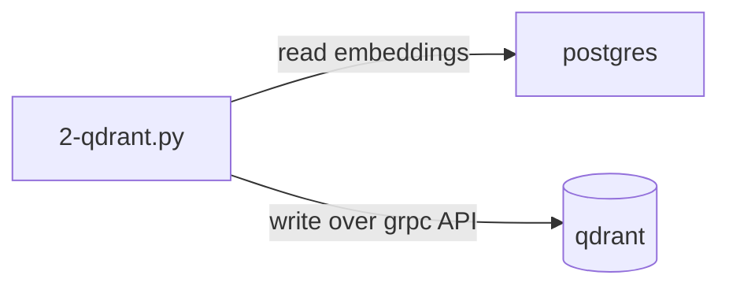
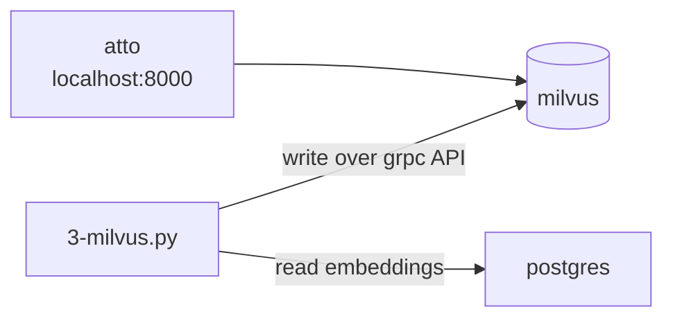
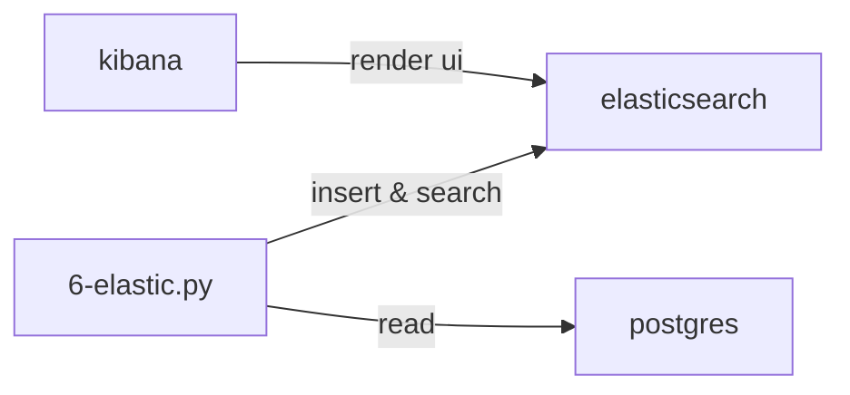

## Vector DBs comparison sandbox on a Biblical multilingual verses

Goal of this repo is to compare different vector databases in terms of performance, load,
ease of use and features.

https://github.com/user-attachments/assets/a622727e-deb7-4b55-95e2-0642bd6f4763

(above - similarity visualization of 4 books of the New Testament of 21k verses in rus_syn)

## Candidates & Results

Results are for 1.4M rows dataset if not specified otherwise.

| Nr  | Engine                                                                 | Ports                                                                           | UI  | Stability | Precision (>=0.9 recall) | Insert speed<br>(avg on 1k batch) | Search (21k rows)    | Search                                                                                  | HDD           | RAM        | Ease of integration 🤯 |
| --- | ---------------------------------------------------------------------- | ------------------------------------------------------------------------------- | --- | --------- | ------------------------ | --------------------------------- | -------------------- | --------------------------------------------------------------------------------------- | ------------- | ---------- | ---------------------- |
| 2   | [Qdrant 1.11.0](https://github.com/qdrant/qdrant)                      | 6334 [6333](http://localhost:6333/dashboard#/collections)                       | 🟢  | 🟢        | 🟢 8/10                  | 🟢 0.129 sec => 0.4 sec           | 🟢 0.008 sec         | 🟢 0.031 sec                                                                            | 🟢 4.8 GB     | 🟢 4.73 GB | ★★★★☆                  |
| 5   | [Weaviate 1.24.22](https://github.com/weaviate/weaviate)               | [8080](http://localhost:8080/v1/schema/Collection_768?_with_meta_count=1) 50051 | 🔴  | 🟢        | 🟡 4/10                  | 🟡 0.411 sec => 2 sec             | 🟢 0.006 sec         | 🟢 0.010 sec                                                                            | 🟢 8.41 GB    | 🟡 8.16 GB | ★★★☆☆                  |
| 6   | [Elastic 8.15](https://github.com/elastic/elasticsearch)               | [5601](http://localhost:5601/app/home#/) 9200                                   | 🟢  | 🟢        | 🟢 10/10                 | 🔴 2.917 sec                      | 🟢 0.008 sec         | 🟡 0.20 sec -> 🟢0.011                                                                  | 🔴 23.46 GB   | 🟢 5.1 GB  | ★★★☆☆                  |
| 7   | [ChromaDB 0.5.5](https://github.com/chroma-core/chroma)                | 8000                                                                            | 🔴  | 🟢        | 🟡 4/10                  | 🔴 1.21 sec => 4 sec              | 🟢 0.018 sec         | 🟡 1.26 sec -> 🟢0.022 sec                                                              | 🟡 12.37 GB   | 🟢 4.86 GB | ★★★★☆                  |
| 3   | [Milvus 2.4.8](https://github.com/milvus-io/milvus)                    | 9091 19530 [8000](http://localhost:8000)                                        | 🟢  | 🟡        | 🔴 0/10                  | 🟢 0.118 sec => 0.4 sec           | 🔴 0.234 sec         | 🟡 0.358 sec                                                                            | 🔴 15 GB      | 🟢 4.59 GB | ★★★☆☆                  |
| 4   | [Redis stack 7.4](https://github.com/redis/redis)                      | 6379 [8001](http://localhost:8001/)                                             | 🟢  | 🟡        | 🟡 3/10                  | 🔴 0.8 => 7 (avg 6.482 sec)       | 🟢 0.002 sec         | 🟢 0.003 sec (1.1M dataset, knn), 🟡 0.04 sec (range)                                   | 🟢 6 GB       | 🔴 10.5 GB | ★★★☆☆                  |
| 1   | Postgres 16.4 + [pgvector 0.7.4](https://github.com/pgvector/pgvector) | 5432                                                                            | 🟡  | 🟢        | 🟡 5/10                  | --                                | 🟡 0.069 sec         | 🔴 6.39 (L1)<br /> 🔴 5.92 (L2)<br /> 🔴 6.608 sec (COS)<br /> 🔴 22.566 sec (no index) | 🟡 11.2 GB \* | 63 MB      | ★★☆☆☆                  |
| 8   | [Marqo 2.11](https://github.com/marqo-ai/marqo)                        | 8882                                                                            | 🔴  | -         | N/A                      | 🔴 4.14 sec                       | 🟡 0.19 -> 0.030 sec | N/A                                                                                     | N/A           | 🟢 5 GB    | ★★☆☆☆                  |

I don't take into account cloud-only solutions like
[Pinecone](https://docs.pinecone.io/guides/get-started/quickstart), [MongoDB Atlas](https://www.mongodb.com/docs/atlas/getting-started/), [SingleStore](https://docs.singlestore.com/cloud/reference/sql-reference/vector-functions/vector-indexing/), [Rockset](https://docs.rockset.com/documentation/docs/vector-search)

I did not have time/energy to also test:
[Vespa](https://github.com/vespa-engine/vespa),
[LanceDB](https://github.com/lancedb/lancedb),
[Clickhouse](https://github.com/ClickHouse/ClickHouse),
[Cassandra](https://github.com/apache/cassandra)

### Testing Approach

Used:

- 💻 Mac M3 36GB RAM (Nov 2023), Sonoma 14.1. On your machine, you likely will get different result. Goal is to compare engines between each other on the same machine.
- 🐍 python 3.11 was used to run test scripts that move the data
  - I tried to measure API time, not the time it takes to generate embeddings
- 🐳 docker with 6 CPU and 12.8GB RAM global limits, no per-container limits
  - single-container dockerized vector databases
  - While testing, only postgres container (as source) and vector-DB-under-test containers were running to reduce potential CPU and I/O interference
- Basic test is to load bible text data and compare search performance
  - I did not use external (OpenAI) APIs for embeddings, but even so, multilingual model for embedding generation was very slow. Thats why I stored it in postgres to not do it in runtime while doing inserts
  - For 21k dataset, I used `WHERE translationId = 'rus_syn'` to filter out data from postgres that had embeddings. Goal is to see how engines perform initially
  - For 1.4M dataset I just used rows that had embeddings in postgres by that time. Goal is to test larger scales of data that engine may see in production and how it degrades
- Most of time is spent on embedding generation (days)
- Insertion speed - note that it is impacted by md5 hash generation for `id`s if engine needs it. Also, reading a batch from postgres takes time.
  - `=>` notation means that as dataset grows, insertion speed gets slower
- Search - I tried to use Cosine similarity with HNSW index
  - `->` notation means that new query or if server just started, then speed is "cold", but on subsequent queries it is "warm" and faster
  - I tested search after starting a container (cold) and then after it was running for a while (warm)
  - When testing multiple times, I tried to use the fastest time
- Storage - I looked at filesystem, not at what engine itself reports in UI (if its able)
- - Note that for postgres, evaluation in addition to 1.4M rows with embeddings, also had 8M other verses
- Ease of integration - Subjective metric based on how easy it was to set up based on guide, docs and example code; How intuitive is API, docker setup and UI.
- RAM - I looked at docker stats memory usage at 1.4M dataset while doing a search.

### Data preparation

For your tests, I would recommend getting dataset from https://huggingface.co/datasets

I used custom dataset:

- Download SQLite data for bible in different languages
  https://bible.helloao.org/bible.db (8.4GB)
- Export `ChapterVerse` from SQLIte to Postgres for better performance. You will need some tool like IntelliJ DataGrip.
  You could use sqlite but it would be very slow.
- Add column `ChapterVerse.embedding` with `store.vector(768)` type
- Create index in postgres for faster updates


```
alter table store."ChapterVerse"
    add embedding store.vector(768);

create index ChapterVerse_translationid_bookid_chapternumber_number_index
  on store."ChapterVerse" (translationid, bookid, chapternumber, number);
```

- Pre-Generate embeddings and store them in same `ChapterVerse`.
  Use multilingual embed model with **768 dim**.
  https://huggingface.co/sentence-transformers/paraphrase-multilingual-mpnet-base-v2

- Spin up vector database you want to test

```
# https://huggingface.co/sentence-transformers/paraphrase-multilingual-mpnet-base-v2
pip install -U sentence-transformers


# Generate embeddings into SQLite
# This will take a while
# You can re-run it to continue from where it stopped
python 0-generate-embeddings.py
```

### 1. Postgres + pgvector

- ✅ Data is stored in Postgres, so no need to sync data between databases
- 🟡 No specialized UI, but you can reuse postgres-specific ones
- 🟡 Mediocre search on small dataset
- 🟡 Operators are not the most intuitive
- 🟡 Limited activity / community
- ❌ Slowest search on large dataset
- ❌ could not install pgvector on Postgres 14 and 15, only version 16 worked
- ❌ faced `psycopg2.errors.UndefinedFunction: operator does not exist: text <-> vector` when installing extension because
  operators were installed into public schema instead of `store`. Had to reset the image and set extension installation under `store` schema.

```bash
docker-compose -f docker-compose.pgvector.yml up postgres --build
python -m pip install "psycopg[binary]"

# generate embeddings
python 1-pgvector.py
```

```sql
alter table store."ChapterVerse"
           add embedding vector

alter table store."ChapterVerse"
alter column embedding type store.vector(768) using embedding::store.vector(768)

CREATE INDEX ON store."ChapterVerse"
   USING hnsw (embedding store.vector_l2_ops)
-- [2024-08-23 02:32:41] completed in 36 m 26 s 299 ms
```

<details>
<summary>Postgres similarity results on 24k dataset</summary>

```
Text: чтобы достигнуть воскресения мертвых.; Similarity: 0.9226886199645554
Text: Но Бог воскресил Его из мертвых.; Similarity: 0.8717796943695277
Text: а Начальника жизни убили. Сего Бог воскресил из мертвых, чему мы свидетели.; Similarity: 0.8707684267530202
Text: Но Христос воскрес из мертвых, первенец из умерших.; Similarity: 0.86272182337587
Text: Так и при воскресении мертвых: сеется в тлении, восстает в нетлении;; Similarity: 0.8626047520415614
Text: и что Он погребен был, и что воскрес в третий день, по Писанию,; Similarity: 0.8371098014647679
Text: Ибо как смерть через человека, так через человека и воскресение мертвых.; Similarity: 0.8319413838804383
Text: которою Он воздействовал во Христе, воскресив Его из мертвых и посадив одесную Себя на небесах,; Similarity: 0.8282566644099042
Text: и гробы отверзлись; и многие тела усопших святых воскресли; Similarity: 0.8217248023128517
Text: быв погребены с Ним в крещении, в Нем вы и совоскресли верою в силу Бога, Который воскресил Его из мертвых,; Similarity: 0.8162701932003219
```

</details>

<details>
<summary>Postgres similarity results on 1.4M dataset, no index</summary>

```
Text: a fin de llegar a la resurrección de entre los muertos.; Similarity: 0.942152166206366
Text: чтобы достигнуть воскресения мертвых.; Similarity: 0.9226886199645554
Text: që në ndonjë mënyrë të mund t’ia arrij ringjalljes prej së vdekurish.; Similarity: 0.9156135526648216
Text: om eenmaal te kunnen komen tot de opstanding uit de doden.; Similarity: 0.9023653865460769
Text: щоб таким чином якось досягти воскресіння з мертвих.; Similarity: 0.9002284663817843
Text: si en alguna manera llegase a la resurrección de los muertos.; Similarity: 0.8967561370447131
Text: अपरं स्मुर्णास्थसमिते र्दूतं प्रतीदं लिख; य आदिरन्तश्च यो मृतवान् पुनर्जीवितवांश्च तेनेदम् उच्यते,; Similarity: 0.8730900101269639
Text: Но Бог воскресил Его из мертвых.; Similarity: 0.8717796943695277
Text: а Начальника жизни убили. Сего Бог воскресил из мертвых, чему мы свидетели.; Similarity: 0.8707684267530202
Text: abych [tak] snad dospěl ke vzkříšení z mrtvých.; Similarity: 0.8700215089349997
```

</details>

<details>
<summary>Postgres similarity results on 1.4M dataset, HNSW index and Cosine distance (`<=>`)</summary>

```
Text: a fin de llegar a la resurrección de entre los muertos.; Similarity: 0.942152166206366
Text: чтобы достигнуть воскресения мертвых.; Similarity: 0.9226886199645554
Text: që në ndonjë mënyrë të mund t’ia arrij ringjalljes prej së vdekurish.; Similarity: 0.9156135526648216
Text: om eenmaal te kunnen komen tot de opstanding uit de doden.; Similarity: 0.9023653865460769
Text: щоб таким чином якось досягти воскресіння з мертвих.; Similarity: 0.9002284663817843
Text: si en alguna manera llegase a la resurrección de los muertos.; Similarity: 0.8967561370447131
Text: अपरं स्मुर्णास्थसमिते र्दूतं प्रतीदं लिख; य आदिरन्तश्च यो मृतवान् पुनर्जीवितवांश्च तेनेदम् उच्यते,; Similarity: 0.8730900101269639
Text: Но Бог воскресил Его из мертвых.; Similarity: 0.8717796943695277
Text: а Начальника жизни убили. Сего Бог воскресил из мертвых, чему мы свидетели.; Similarity: 0.8707684267530202
Text: abych [tak] snad dospěl ke vzkříšení z mrtvých.; Similarity: 0.8700215089349997
```

</details>

<details>
<summary>Postgres similarity results on 1.4M dataset, HNSW index and L1 distance (`<+>`)</summary>

```
Text: a fin de llegar a la resurrección de entre los muertos.; Similarity: -15.984977722167969
Text: чтобы достигнуть воскресения мертвых.; Similarity: -17.258892059326172
Text: që në ndonjë mënyrë të mund t’ia arrij ringjalljes prej së vdekurish.; Similarity: -17.903274536132812
Text: щоб таким чином якось досягти воскресіння з мертвих.; Similarity: -19.21749496459961
Text: om eenmaal te kunnen komen tot de opstanding uit de doden.; Similarity: -19.965681076049805
Text: si en alguna manera llegase a la resurrección de los muertos.; Similarity: -22.477447509765625
Text: अपरं स्मुर्णास्थसमिते र्दूतं प्रतीदं लिख; य आदिरन्तश्च यो मृतवान् पुनर्जीवितवांश्च तेनेदम् उच्यते,; Similarity: -22.769420623779297
Text: а Начальника жизни убили. Сего Бог воскресил из мертвых, чему мы свидетели.; Similarity: -22.937271118164062
Text: а Пачынальніка Жыцьця забілі; Гэтага Бог уваскрэсіў зь мёртвых, і мы сьведкі таго.; Similarity: -23.431766510009766
Text: hogy így eljuthassak a halottak feltámadására.; Similarity: -23.694473266601562
```

</details>
<details>
<summary>Postgres similarity results on 1.4M dataset, HNSW index and L2 distance (`<->`)</summary>

```
Text: a fin de llegar a la resurrección de entre los muertos.; Similarity: 0.2030089967677845
Text: чтобы достигнуть воскресения мертвых.; Similarity: 0.14195527821053566
Text: që në ndonjë mënyrë të mund t’ia arrij ringjalljes prej së vdekurish.; Similarity: 0.10919599491552112
Text: щоб таким чином якось досягти воскресіння з мертвих.; Similarity: 0.03218261941693723
Text: om eenmaal te kunnen komen tot de opstanding uit de doden.; Similarity: 0.0027483321380983305
Text: si en alguna manera llegase a la resurrección de los muertos.; Similarity: -0.08676286247228848
Text: а Начальника жизни убили. Сего Бог воскресил из мертвых, чему мы свидетели.; Similarity: -0.10283884546121591
Text: अपरं स्मुर्णास्थसमिते र्दूतं प्रतीदं लिख; य आदिरन्तश्च यो मृतवान् पुनर्जीवितवांश्च तेनेदम् उच्यते,; Similarity: -0.1064100807014805
Text: а Пачынальніка Жыцьця забілі; Гэтага Бог уваскрэсіў зь мёртвых, і мы сьведкі таго.; Similarity: -0.15120845409069927
Text: Так и при воскресении мертвых: сеется в тлении, восстает в нетлении;; Similarity: -0.15640871144354795
```

</details>

#### How to visualize embeddings

You can use [cosmograph](https://cosmograph.app/run/) online tool to visualize nodes and edges.

<details>
<summary>Exporting data for visualization</summary>

Export nodes into CSV:

```sql
SELECT CONCAT(translationid, '-', bookid, '-', chapternumber, '-', number) as id,
       text                                                                as label
FROM store."ChapterVerse"
WHERE embedding IS NOT NULL
  AND translationId = 'rus_syn'
  AND bookid IN ('JHN', 'LUK', 'MRK', 'MAT') LIMIT 10000;
```

Export edges into CSV:

```sql
SET
search_path TO store;
WITH pairwise_similarity
         AS (SELECT CONCAT(t1.translationid, '-', t1.bookid, '-', t1.chapternumber, '-', t1.number) AS source,
                    CONCAT(t2.translationid, '-', t2.bookid, '-', t2.chapternumber, '-', t2.number) AS target,
                    1 - (t1.embedding <=> t2.embedding)                                             AS similarity
             FROM store."ChapterVerse" t1,
                  store."ChapterVerse" t2
             WHERE t1.bookid IN ('JHN', 'LUK', 'MRK', 'MAT')
               AND t2.bookid IN ('JHN', 'LUK', 'MRK', 'MAT')
               AND t1.translationId = 'rus_syn'
               AND t2.translationId = 'rus_syn'
               AND t1.embedding IS NOT NULL
               AND t2.embedding IS NOT NULL
               AND CONCAT(t1.translationid, '-', t1.bookid, '-', t1.chapternumber, '-',
                          t1.number) != CONCAT(t2.translationid, '-', t2.bookid, '-', t2.chapternumber, '-', t2.number)
    )
SELECT source,
       target,
       similarity AS weight
FROM pairwise_similarity
WHERE similarity > 0.95
ORDER BY weight DESC LIMIT 10000;

```

</details>

### 2. Qdrant

- ✅ very clear API and docs
- ✅ fast search
- ✅ built-in index creation at collection setup
- ✅ has no-wait / async indexing
- ✅ good community & PR activity
- 🟡 has built-in UI with, but you need to type to search; has embedding visualization
- 🟡 required entry to have `id`
- ❌ Failing on starting `ERROR qdrant::startup: Panic occurred in file /qdrant/lib/collection/src/shards/replica_set/mod.rs at line 277: Failed to load local shard "./storage/collections/collection_768/0": Service internal error: Not a directory (os error 20)`
- ❌ Failed at 920k, possibly related to docker?

```
grpc._channel._InactiveRpcError: <_InactiveRpcError of RPC that terminated with:
	status = StatusCode.UNAVAILABLE
	details = "failed to connect to all addresses; last error: UNKNOWN: ipv4:0.0.0.0:6334: Failed to connect to remote host: connect: Connection refused (61)"
	debug_error_string = "UNKNOWN:Error received from peer  {grpc_message:"failed to connect to all addresses; last error: UNKNOWN: ipv4:0.0.0.0:6334: Failed to connect to remote host: connect: Connection refused (61)", grpc_status:14, created_time:"2024-08-22T04:34:22.315805+03:00"}"
>
```



```
docker-compose -f docker-compose.qdrant.yml up qdrant

python -m pip install 'qdrant-client'

# Test Qdrant
python 2-qdrant.py
```


<details>
<summary>Qdrant similarity results on 21k dataset</summary>

```
Text: чтобы достигнуть воскресения мертвых.; Similarity: 0.9226888418197632
Text: Но Бог воскресил Его из мертвых.; Similarity: 0.8717798590660095
Text: а Начальника жизни убили. Сего Бог воскресил из мертвых, чему мы свидетели.; Similarity: 0.8707683682441711
Text: Но Христос воскрес из мертвых, первенец из умерших.; Similarity: 0.8627219200134277
Text: Так и при воскресении мертвых: сеется в тлении, восстает в нетлении;; Similarity: 0.8626047968864441
Text: и что Он погребен был, и что воскрес в третий день, по Писанию,; Similarity: 0.8371099233627319
Text: Ибо как смерть через человека, так через человека и воскресение мертвых.; Similarity: 0.8319414258003235
Text: которою Он воздействовал во Христе, воскресив Его из мертвых и посадив одесную Себя на небесах,; Similarity: 0.8282566666603088
Text: и гробы отверзлись; и многие тела усопших святых воскресли; Similarity: 0.8217248916625977
Text: быв погребены с Ним в крещении, в Нем вы и совоскресли верою в силу Бога, Который воскресил Его из мертвых,; Similarity: 0.8162703514099121
```

</details>

<details>
<summary>Qdrant similarity results on 1.4M dataset</summary>

```
Text: a fin de llegar a la resurrección de entre los muertos.; Similarity: 0.9421520829200745
Text: a fin de llegar a la resurrección de entre los muertos.; Similarity: 0.9421520829200745
Text: a fin de llegar a la resurrección de entre los muertos.; Similarity: 0.9421520829200745
Text: чтобы достигнуть воскресения мертвых.; Similarity: 0.9226888418197632
Text: чтобы достигнуть воскресения мертвых.; Similarity: 0.9226888418197632
Text: që në ndonjë mënyrë të mund t’ia arrij ringjalljes prej së vdekurish.; Similarity: 0.9156136512756348
Text: që në ndonjë mënyrë të mund t’ia arrij ringjalljes prej së vdekurish.; Similarity: 0.9156136512756348
Text: om eenmaal te kunnen komen tot de opstanding uit de doden.; Similarity: 0.9023655652999878
Text: अपरं स्मुर्णास्थसमिते र्दूतं प्रतीदं लिख; य आदिरन्तश्च यो मृतवान् पुनर्जीवितवांश्च तेनेदम् उच्यते,; Similarity: 0.8730900287628174
Text: अपरं स्मुर्णास्थसमिते र्दूतं प्रतीदं लिख; य आदिरन्तश्च यो मृतवान् पुनर्जीवितवांश्च तेनेदम् उच्यते,; Similarity: 0.8730900287628174
```

</details>

### 3. Milvus

- ✅ Docs look impressive
- ✅ good community & PR activity
- 🟡 Has concept of "loading" and unloading a collection (from memory)
- 🟡 Takes ~20 sec to start up (compared to others)
- 🟡 Milvus does not come with built-in UI, so we use `attu` for that.
- 🟡 Has extra containers
- ❌ Large usage of Storage. minio/insert_log looks suspicious.
- ❌ Search was slow, even though it used an index (maybe I did something wrong?)
- ❌ Failed at insertion @ 683k and second attempt at @ 989k. No errors in milvus logs. UI and client just loose connection and server is not responsive. Becomes accessible after restart. Maybe related to out of memory?
- Succeeded on third attempt

```pymilvus.exceptions.MilvusException: <MilvusException: (code=<bound method _MultiThreadedRendezvous.code of <_MultiThreadedRendezvous of RPC that terminated with:
	status = StatusCode.UNAVAILABLE
	details = "failed to connect to all addresses; last error: UNKNOWN: ipv4:127.0.0.1:19530: Failed to connect to remote host: connect: Connection refused (61)"
	debug_error_string = "UNKNOWN:Error received from peer  {grpc_message:"failed to connect to all addresses; last error: UNKNOWN: ipv4:127.0.0.1:19530: Failed to connect to remote host: connect: Connection refused (61)", grpc_status:14, created_time:"2024-08-22T04:07:48.480463+03:00"}"
>>, message=Retry run out of 75 retry times, message=failed to connect to all addresses; last error: UNKNOWN: ipv4:127.0.0.1:19530: Failed to connect to remote host: connect: Connection refused (61))>

pymilvus.exceptions.MilvusException: <MilvusException: (code=2, message=Fail connecting to server on localhost:19530, illegal connection params or server unavailable)>
```

Some suspicious logs:

```
milvus-standalone  | [2024/08/22 19:51:46.460 +00:00] [WARN] [checkers/index_checker.go:139] ["failed to get indexInfo for segment"] [collectionID=452028396578800432] [segmentID=452028396580013227] [error="index not found[segmentID=452028396580013227]"]
milvus-standalone  | [2024/08/22 19:51:46.919 +00:00] [INFO] [datacoord/task_scheduler.go:214] ["there is no idle indexing node, wait a minute..."]
```



```bash
python -m pip install pymilvus
docker-compose -f docker-compose.milvus.yml up
```


<details>
<summary>Milvus similarity results on 21k dataset</summary>

```
Text: чтобы достигнуть воскресения мертвых.; Similarity: 0.9226888418197632
Text: Но Бог воскресил Его из мертвых.; Similarity: 0.8717797994613647
Text: а Начальника жизни убили. Сего Бог воскресил из мертвых, чему мы свидетели.; Similarity: 0.8707685470581055
Text: Но Христос воскрес из мертвых, первенец из умерших.; Similarity: 0.8627219796180725
Text: Так и при воскресении мертвых: сеется в тлении, восстает в нетлении;; Similarity: 0.8626042604446411
Text: и что Он погребен был, и что воскрес в третий день, по Писанию,; Similarity: 0.8371096253395081
Text: Ибо как смерть через человека, так через человека и воскресение мертвых.; Similarity: 0.831940770149231
Text: которою Он воздействовал во Христе, воскресив Его из мертвых и посадив одесную Себя на небесах,; Similarity: 0.8282568454742432
Text: и гробы отверзлись; и многие тела усопших святых воскресли; Similarity: 0.8217248320579529
Text: быв погребены с Ним в крещении, в Нем вы и совоскресли верою в силу Бога, Который воскресил Его из мертвых,; Similarity: 0.8162701725959778
```

</details>

<details>
<summary>Milvus similarity results on 1.4M dataset</summary>

```
Text: अपरं स्मुर्णास्थसमिते र्दूतं प्रतीदं लिख; य आदिरन्तश्च यो मृतवान् पुनर्जीवितवांश्च तेनेदम् उच्यते,; Similarity: 0.8730900883674622
Text: अपरं स्मुर्णास्थसमिते र्दूतं प्रतीदं लिख; य आदिरन्तश्च यो मृतवान् पुनर्जीवितवांश्च तेनेदम् उच्यते,; Similarity: 0.8730900883674622
Text: मृतानां पुनरुत्थिति र्व्यतीतेति वदन्तौ केषाञ्चिद् विश्वासम् उत्पाटयतश्च।; Similarity: 0.8565160632133484
Text: אשר פעל במשיח בהעיר אתו מן המתים ויושיבנו לימינו במרומים׃; Similarity: 0.8483075499534607
Text: του ορισθεντος υιου θεου εν δυναμει κατα πνευμα αγιωσυνης εξ αναστασεως νεκρων ιησου χριστου του κυριου ημων; Similarity: 0.8435214757919312
Text: του ορισθεντος υιου θεου εν δυναμει κατα πνευμα αγιωσυνης εξ αναστασεως νεκρων ιησου χριστου του κυριου ημων; Similarity: 0.8435214757919312
Text: και οντας ημας νεκρους τοις παραπτωμασιν συνεζωοποιησεν τω χριστω χαριτι εστε σεσωσμενοι; Similarity: 0.8367748260498047
Text: ευλογητος ο θεος και πατηρ του κυριου ημων ιησου χριστου ο κατα το πολυ αυτου ελεος αναγεννησας ημας εις ελπιδα ζωσαν δι αναστασεως ιησου χριστου εκ νεκρων; Similarity: 0.8299326300621033
Text: которою Он воздействовал во Христе, воскресив Его из мертвых и посадив одесную Себя на небесах,; Similarity: 0.8282567262649536
Text: 死而复生所展现的惊人能力。上帝在天上将基督安置在他的右手边，; Similarity: 0.8202930092811584
```

</details>

### 4. Redis

- ✅ As we use redis-stack, it came with redis-insight UI bundled. UI is nice, but not vector-specific. Can't see indexes or visualize embeddings.
  - Open UI at `http://localhost:8001/`, use `pass` as password
  - Use bulk actions to clean up data if needed
- 🟡 API/Command syntax was not intuitive, had to spend too much time reverse-engineering it from docs and examples.
  `redis.exceptions.ResponseError: Property vector_score not loaded nor in schema` while trying to search - index and query need to match
- 🟡 `unknown command 'JSON.SET'` while using `redis` image, likely related to JSON extension, had to switch to `redis-stack` image.
- 🟡 custom license
- 🟡 docs are confusing
- 🟡 `MISCONF Redis is configured to save RDB snapshots, but it's currently unable to persist to disk` while deleting keys
- ❌ slow insert speed, gets worse as amount of data grows 1.3 sec -> 7 sec per minibatch (1k rows). Maybe it has to do with the way embeddings are passed?
- note that JSON -> HSET switch and pipeline fix did not improve the speed much
- CPU on redis side was 100% loaded as observed from docker
- ❌ On first Redis failed to ingest all rows (maybe I did some misconfiguration?).
  `redis.exceptions.BusyLoadingError: Redis is loading the dataset in memory` random error while loading dataset at 336K rows and 8.6GB of memory;
- ❌ Second attempt - failed with `SERVER_CLOSED_CONNECTION_ERROR` in pipeline.execute(). UI cannot connect to server anymore even if it looks running
- ❌ Search was slow, even though it used an index (maybe I did something wrong?)

Improvements and third attempt:

- ✅ Storage: JSON.set was changed -> HSET
- Insertion: Reusing pipeline to insert data
- ✅ Search: Range query was changed -> KNN.
- ✅ New attempt- succeeded with 1M rows. Insert speeds at times reached 10 sec per 1k rows (bad).
- 🟡 I also did experience > 5 insert disruptions while inserting after 1M rows, effectively breaking insertion, but there were no error logs or exceptions that would explain why.
  The script just ended insertion but still performed search (both operations are in the same script). Likely related to something with my script or setup again. Maybe missing error catching or pipeline handling.
  After encountering this, I adjusted offset to continue insertion from position that was left off.
- ❌ Failed at 1.33M rows, likely due to memory limits (see logs below). After restarting, I couldn't connect to the server again.

<details>
<summary>Logs</summary>

docker logs before failure:

```bash
redis-1 | 498:C 20 Sep 2024 09:51:56.499 _ DB saved on disk
redis-1 | 498:C 20 Sep 2024 09:51:56.641 _ Fork CoW for RDB: current 1108 MB, peak 1108 MB, average 609 MB
redis-1 | 9:M 20 Sep 2024 09:51:56.935 _ Background saving terminated with success
redis-1 | 9:M 20 Sep 2024 09:52:57.046 _ 10000 changes in 60 seconds. Saving...
redis-1 | 9:M 20 Sep 2024 09:52:57.136 \* Background saving started by pid 501
redis-1 | 9:M 20 Sep 2024 09:53:43.928 # Can't fork for module: File exists
redis-1 | 9:M 20 Sep 2024 09:53:43.928 # <module> fork failed - got errno 17, aborting fork GC
redis-1 | 9:M 20 Sep 2024 09:53:55.054 # Can't fork for module: File exists
redis-1 | 9:M 20 Sep 2024 09:53:55.055 # <module> fork failed - got errno 17, aborting fork GC
redis-1 | 9:M 20 Sep 2024 09:54:07.963 # Can't fork for module: File exists
redis-1 | 9:M 20 Sep 2024 09:54:07.963 # <module> fork failed - got errno 17, aborting fork GC
redis-1 | Killed
redis-1 | 501:signal-handler (1726826059) Received SIGTERM scheduling shutdown...
redis-1 exited with code 0
```

python client failures:
```python
Traceback (most recent call last):
  File "/Users/artjom/git/vector-dbs-comparison/4-redis.py", line 121, in <module>
    read_verses(
  File "/Users/artjom/git/vector-dbs-comparison/common.py", line 83, in read_verses
    elapsed_time += handler(chunk, pipeline)
                    ^^^^^^^^^^^^^^^^^^^^^^^^
  File "/Users/artjom/git/vector-dbs-comparison/4-redis.py", line 71, in redis_inserts
    pipeline.execute()
  File "/opt/homebrew/lib/python3.11/site-packages/redis/client.py", line 1503, in execute
    return conn.retry.call_with_retry(
           ^^^^^^^^^^^^^^^^^^^^^^^^^^^
  File "/opt/homebrew/lib/python3.11/site-packages/redis/retry.py", line 65, in call_with_retry
    fail(error)
  File "/opt/homebrew/lib/python3.11/site-packages/redis/client.py", line 1505, in <lambda>
    lambda error: self._disconnect_raise_reset(conn, error),
                  ^^^^^^^^^^^^^^^^^^^^^^^^^^^^^^^^^^^^^^^^^
  File "/opt/homebrew/lib/python3.11/site-packages/redis/client.py", line 1481, in _disconnect_raise_reset
    raise error
  File "/opt/homebrew/lib/python3.11/site-packages/redis/retry.py", line 62, in call_with_retry
    return do()
           ^^^^
  File "/opt/homebrew/lib/python3.11/site-packages/redis/client.py", line 1504, in <lambda>
    lambda: execute(conn, stack, raise_on_error),
            ^^^^^^^^^^^^^^^^^^^^^^^^^^^^^^^^^^^^
  File "/opt/homebrew/lib/python3.11/site-packages/redis/client.py", line 1412, in _execute_pipeline
    response.append(self.parse_response(connection, args[0], **options))
                    ^^^^^^^^^^^^^^^^^^^^^^^^^^^^^^^^^^^^^^^^^^^^^^^^^^^
  File "/opt/homebrew/lib/python3.11/site-packages/redis/client.py", line 1435, in parse_response
    result = Redis.parse_response(self, connection, command_name, **options)
             ^^^^^^^^^^^^^^^^^^^^^^^^^^^^^^^^^^^^^^^^^^^^^^^^^^^^^^^^^^^^^^^
  File "/opt/homebrew/lib/python3.11/site-packages/redis/client.py", line 565, in parse_response
    response = connection.read_response()
               ^^^^^^^^^^^^^^^^^^^^^^^^^^
  File "/opt/homebrew/lib/python3.11/site-packages/redis/connection.py", line 512, in read_response
    response = self._parser.read_response(disable_decoding=disable_decoding)
               ^^^^^^^^^^^^^^^^^^^^^^^^^^^^^^^^^^^^^^^^^^^^^^^^^^^^^^^^^^^^^
  File "/opt/homebrew/lib/python3.11/site-packages/redis/_parsers/resp2.py", line 15, in read_response
    result = self._read_response(disable_decoding=disable_decoding)
             ^^^^^^^^^^^^^^^^^^^^^^^^^^^^^^^^^^^^^^^^^^^^^^^^^^^^^^
  File "/opt/homebrew/lib/python3.11/site-packages/redis/_parsers/resp2.py", line 25, in _read_response
    raw = self._buffer.readline()
          ^^^^^^^^^^^^^^^^^^^^^^^
  File "/opt/homebrew/lib/python3.11/site-packages/redis/_parsers/socket.py", line 115, in readline
    self._read_from_socket()
  File "/opt/homebrew/lib/python3.11/site-packages/redis/_parsers/socket.py", line 68, in _read_from_socket
    raise ConnectionError(SERVER_CLOSED_CONNECTION_ERROR)
redis.exceptions.ConnectionError: Connection closed by server.
```

</details>

```bash
docker-compose -f docker-compose.redis.yml up
python 4-redis.py
```

Docs:
https://redis-py.readthedocs.io/en/stable/examples/search_vector_similarity_examples.html


<details>
<summary>Redis similarity results on 21k dataset with KNN query 0.002 sec</summary>

```
Text: чтобы достигнуть воскресения мертвых.; Similarity: 0.92
Text: а Начальника жизни убили. Сего Бог воскресил из мертвых, чему мы свидетели.; Similarity: 0.87
Text: которою Он воздействовал во Христе, воскресив Его из мертвых и посадив одесную Себя на небесах,; Similarity: 0.83
Text: быв погребены с Ним в крещении, в Нем вы и совоскресли верою в силу Бога, Который воскресил Его из мертвых,; Similarity: 0.82
Text: Посему сказано: “встань, спящий, и воскресни из мертвых, и осветит тебя Христос”.; Similarity: 0.79
Text: и открылся Сыном Божиим в силе, по духу святыни, через воскресение из мертвых, о Иисусе Христе Господе нашем,; Similarity: 0.79
Text: и воскресил с Ним, и посадил на небесах во Христе Иисусе,; Similarity: 0.78
Text: Который предан за грехи наши и воскрес для оправдания нашего.; Similarity: 0.77
Text: Благословен Бог и Отец Господа нашего Иисуса Христа, по великой Своей милости возродивший нас воскресением Иисуса Христа из мертвых к упованию живому,; Similarity: 0.76
Text: умершего за нас, чтобы мы бодрствуем ли, или спим, жили вместе с Ним.; Similarity: 0.75
```

</details>

<details>
<summary>Redis similarity results on 21k dataset with vector range query (0.04 sec)</summary>

```
Text: чтобы достигнуть воскресения мертвых.; Similarity: 0.92
Text: Но Бог воскресил Его из мертвых.; Similarity: 0.87
Text: а Начальника жизни убили. Сего Бог воскресил из мертвых, чему мы свидетели.; Similarity: 0.87
Text: Но Христос воскрес из мертвых, первенец из умерших.; Similarity: 0.86
Text: Так и при воскресении мертвых: сеется в тлении, восстает в нетлении;; Similarity: 0.86
Text: и что Он погребен был, и что воскрес в третий день, по Писанию,; Similarity: 0.84
Text: Ибо как смерть через человека, так через человека и воскресение мертвых.; Similarity: 0.83
Text: которою Он воздействовал во Христе, воскресив Его из мертвых и посадив одесную Себя на небесах,; Similarity: 0.83
Text: и гробы отверзлись; и многие тела усопших святых воскресли; Similarity: 0.82
Text: быв погребены с Ним в крещении, в Нем вы и совоскресли верою в силу Бога, Который воскресил Его из мертвых,; Similarity: 0.82
```

</details>


<details>
<summary>Redis similarity results on 1.1/1.3M dataset with KNN query</summary>

```
Text: a fin de llegar a la resurrección de entre los muertos.; Similarity: 0.94
Text: чтобы достигнуть воскресения мертвых.; Similarity: 0.92
Text: щоб таким чином якось досягти воскресіння з мертвих.; Similarity: 0.9
Text: per giungere in qualche modo alla risurrezione dei morti.; Similarity: 0.89
Text: अपरं स्मुर्णास्थसमिते र्दूतं प्रतीदं लिख; य आदिरन्तश्च यो मृतवान् पुनर्जीवितवांश्च तेनेदम् उच्यते,; Similarity: 0.87
Text: Но Бог воскресил Его из мертвых.; Similarity: 0.87
Text: а Начальника жизни убили. Сего Бог воскресил из мертвых, чему мы свидетели.; Similarity: 0.87
Text: if any way I arrive at the resurrection from among [the] dead.; Similarity: 0.86
Text: येन केनचित् प्रकारेण मृतानां पुनरुत्थितिं प्राप्तुं यते।; Similarity: 0.86
Text: যীশু খ্রীষ্টকে স্মরণ করো, যিনি মৃতলোক থেকে পুনরুত্থিত হয়েছেন এবং যিনি দাউদের বংশজাত। এই হল আমার সুসমাচার।; Similarity: 0.83
```
</details>


### 5. Weaviate

```bash
docker-compose -f docker-compose.weaviate.yml up weaviate
````

- ✅ Fastest search
- ✅ Lots of docs, Multitenancy, Replication
- 🟡 But Docs are confusing, emphasize cloud or older client versions, emphasizes OpenAI embeddings and configs instead of custom ones
- 🟡 API at times confusing - `Failed to send 20 objects in a batch of 20. Please inspect client.batch.failed_objects or collection.batch.failed_objects for the failed objects` instead of showing errors.
  - Did not like `id` or `vector` in properties
- ❌ slow insert speed gets worse as amount of data grows 0.4 sec -> 2.5 sec
- ❌ Has no management UI, only API


<details>
<summary>Weaviate similarity results on 21k dataset</summary>

```
Text: чтобы достигнуть воскресения мертвых.; Similarity: 0.9226889610290527
Text: Но Бог воскресил Его из мертвых.; Similarity: 0.8717796802520752
Text: а Начальника жизни убили. Сего Бог воскресил из мертвых, чему мы свидетели.; Similarity: 0.8707684278488159
Text: Но Христос воскрес из мертвых, первенец из умерших.; Similarity: 0.862721860408783
Text: Так и при воскресении мертвых: сеется в тлении, восстает в нетлении;; Similarity: 0.8626049160957336
Text: и что Он погребен был, и что воскрес в третий день, по Писанию,; Similarity: 0.8371100425720215
Text: Ибо как смерть через человека, так через человека и воскресение мертвых.; Similarity: 0.8319416046142578
Text: которою Он воздействовал во Христе, воскресив Его из мертвых и посадив одесную Себя на небесах,; Similarity: 0.8282566666603088
Text: и гробы отверзлись; и многие тела усопших святых воскресли; Similarity: 0.8217248320579529
Text: быв погребены с Ним в крещении, в Нем вы и совоскресли верою в силу Бога, Который воскресил Его из мертвых,; Similarity: 0.8162702322006226
```

</details>

<details>
<summary>Weaviate similarity results on 1.4M dataset</summary>

```
Text: a fin de llegar a la resurrección de entre los muertos.; Similarity: 0.9421523809432983
Text: a fin de llegar a la resurrección de entre los muertos.; Similarity: 0.9421523809432983
Text: чтобы достигнуть воскресения мертвых.; Similarity: 0.9226889610290527
Text: që në ndonjë mënyrë të mund t’ia arrij ringjalljes prej së vdekurish.; Similarity: 0.9156137108802795
Text: अपरं स्मुर्णास्थसमिते र्दूतं प्रतीदं लिख; य आदिरन्तश्च यो मृतवान् पुनर्जीवितवांश्च तेनेदम् उच्यते,; Similarity: 0.8730896711349487
Text: अपरं स्मुर्णास्थसमिते र्दूतं प्रतीदं लिख; य आदिरन्तश्च यो मृतवान् पुनर्जीवितवांश्च तेनेदम् उच्यते,; Similarity: 0.8730896711349487
Text: Но Бог воскресил Его из мертвых.; Similarity: 0.8717796802520752
Text: abych [tak] snad dospěl ke vzkříšení z mrtvých.; Similarity: 0.8700212836265564
Text: abych [tak] snad dospěl ke vzkříšení z mrtvých.; Similarity: 0.8700212836265564
Text: abych [tak] snad dospěl ke vzkříšení z mrtvých.; Similarity: 0.8700212836265564
```

</details>

### 6. Elastic

- ✅ Has very nice kibana UI, highlighting indexes and properties used
- 🟡 Custom license, had to use `basic` for testing
- ❌ Has strict security `fatal exception while booting Elasticsearch: cannot read configured PEM certificate_authorities`, had to disable SSL and other security checks

```bash
docker-compose -f docker-compose.elastic.yml up
```




<details>
<summary>Elastic similarity results on 21k dataset</summary>

```
Text: чтобы достигнуть воскресения мертвых.; Similarity: 0.95788
Text: Но Бог воскресил Его из мертвых.; Similarity: 0.9358952
Text: а Начальника жизни убили. Сего Бог воскресил из мертвых, чему мы свидетели.; Similarity: 0.9356406
Text: Но Христос воскрес из мертвых, первенец из умерших.; Similarity: 0.93155193
Text: Так и при воскресении мертвых: сеется в тлении, восстает в нетлении;; Similarity: 0.9310014
Text: и что Он погребен был, и что воскрес в третий день, по Писанию,; Similarity: 0.9184923
Text: Ибо как смерть через человека, так через человека и воскресение мертвых.; Similarity: 0.91571283
Text: которою Он воздействовал во Христе, воскресив Его из мертвых и посадив одесную Себя на небесах,; Similarity: 0.914495
Text: и гробы отверзлись; и многие тела усопших святых воскресли; Similarity: 0.91006994
Text: быв погребены с Ним в крещении, в Нем вы и совоскресли верою в силу Бога, Который воскресил Его из мертвых,; Similarity: 0.9080174

```

</details>

<details>
<summary>Elastic similarity results on 1.4M dataset</summary>

```
Text: чтобы достигнуть воскресения мертвых.; Similarity: 0.9605174
Text: që në ndonjë mënyrë të mund t’ia arrij ringjalljes prej së vdekurish.; Similarity: 0.95751595
Text: om eenmaal te kunnen komen tot de opstanding uit de doden.; Similarity: 0.95071626
Text: om eenmaal te kunnen komen tot de opstanding uit de doden.; Similarity: 0.95071626
Text: om eenmaal te kunnen komen tot de opstanding uit de doden.; Similarity: 0.95071626
Text: om eenmaal te kunnen komen tot de opstanding uit de doden.; Similarity: 0.95071626
Text: om eenmaal te kunnen komen tot de opstanding uit de doden.; Similarity: 0.95071626
Text: щоб таким чином якось досягти воскресіння з мертвих.; Similarity: 0.9491937
Text: щоб таким чином якось досягти воскресіння з мертвих.; Similarity: 0.9491937
Text: Но Бог воскресил Его из мертвых.; Similarity: 0.9359567

```

</details>

### 7. ChromaDB

- ✅ Very straightforward quickstart guide
- 🟡 API is confusing as it looks like column DB
- ❌ Because of column API, one-by-one insertion speed is very slow. Likely could be improved though if multiple columns are first changed.
- ❌ `TypeError: Descriptors cannot be created directly in chromadb.telemetry.opentelemetry `, had to set `PROTOCOL_BUFFERS_PYTHON_IMPLEMENTATION=python` env var
- ❌ [No batching support](https://cookbook.chromadb.dev/strategies/batching/#creating-batches)
- ❌ `chromadb.api.configuration.InvalidConfigurationError: batch_size must be less than or equal to sync_threshold` when trying to `client.get_or_create_collection` due to mismatching client and server versions

```bash
docker-compose -f docker-compose.chromadb.yml up
```


<details>
<summary>ChromaDB similarity results on 21k dataset</summary>

```
Text: чтобы достигнуть воскресения мертвых.; Similarity: 0.9226889610290527
Text: Но Бог воскресил Его из мертвых.; Similarity: 0.8717796206474304
Text: а Начальника жизни убили. Сего Бог воскресил из мертвых, чему мы свидетели.; Similarity: 0.8707686066627502
Text: Но Христос воскрес из мертвых, первенец из умерших.; Similarity: 0.8627220392227173
Text: Так и при воскресении мертвых: сеется в тлении, восстает в нетлении;; Similarity: 0.8626042008399963
Text: и что Он погребен был, и что воскрес в третий день, по Писанию,; Similarity: 0.8371098637580872
Text: Ибо как смерть через человека, так через человека и воскресение мертвых.; Similarity: 0.8319410681724548
Text: которою Он воздействовал во Христе, воскресив Его из мертвых и посадив одесную Себя на небесах,; Similarity: 0.8282561898231506
Text: и гробы отверзлись; и многие тела усопших святых воскресли; Similarity: 0.8217248320579529
Text: быв погребены с Ним в крещении, в Нем вы и совоскресли верою в силу Бога, Который воскресил Его из мертвых,; Similarity: 0.8162698745727539
```

</details>
<details>
<summary>ChromaDB similarity results on 1.4M dataset</summary>

```
Text: a fin de llegar a la resurrección de entre los muertos.; Similarity: 0.9421521425247192
Text: që në ndonjë mënyrë të mund t’ia arrij ringjalljes prej së vdekurish.; Similarity: 0.9156137108802795
Text: om eenmaal te kunnen komen tot de opstanding uit de doden.; Similarity: 0.9023656249046326
Text: щоб таким чином якось досягти воскресіння з мертвих.; Similarity: 0.9002282023429871
Text: si en alguna manera llegase a la resurrección de los muertos.; Similarity: 0.8967559337615967
Text: अपरं स्मुर्णास्थसमिते र्दूतं प्रतीदं लिख; य आदिरन्तश्च यो मृतवान् पुनर्जीवितवांश्च तेनेदम् उच्यते,; Similarity: 0.8730899095535278
Text: Но Бог воскресил Его из мертвых.; Similarity: 0.8717796206474304
Text: abych [tak] snad dospěl ke vzkříšení z mrtvých.; Similarity: 0.870021402835846
Text: hogy így eljuthassak a halottak feltámadására.; Similarity: 0.8691048622131348
Text: hogy így eljuthassak a halottak feltámadására.; Similarity: 0.8691048622131348
```

</details>

### 8. Marqo

- Comes with built-in models like `hf/e5-base-v2` and `open_clip/ViT-B-32/laion2b_s34b_b79k`
- 🟡 No management UI, only API
- 🟡 API and docs are confusing, emphasize built-in embedding models, was hard to inject **custom** embeddings, hard to create index with proper schema and use search. Had issues like:
  `marqo.errors.MarqoWebError: MarqoWebError: MarqoWebError Error message: {'message': '[{"loc": ["__root__"], "msg": "Field \'custom\' has type \'custom_vector\' and must be a tensor field.`
  `marqo.errors.MarqoWebError: MarqoWebError: MarqoWebError Error message: {'message': "Cannot specify 'tensorFields' when adding documents to a structured index. 'tensorFields' must be defined in structured index schema at index creation time",`

- ❌ does not support 1k batch, only 128, had to lower it but it impacts insert speed. `marqo.errors.MarqoWebError: MarqoWebError: MarqoWebError Error message: {'message': 'Number of docs in add documents request (1000) exceeds limit of 128. If using the Python client, break up your `add_documents`request into smaller batches using its`client_batch_size` parameter.`
  - I used CPU-based indexing. Docs and other guides say that GPU-based is faster
- ❌ was unable to use docker volumes, got: `marqo.errors.MarqoWebError: MarqoWebError: MarqoWebError Error message: {'message': "Marqo cannot connect to Zookeeper`
- ❌ with pure docker image, I couldn't go past 24k, I received errors like:
  - `Marqo vector store is out of memory or disk space`, also may be because of some docker configs?
  - `marqo-1  | marqo.vespa.exceptions.VespaStatusError: 507: {"pathId":"/document/v1/marqo__settings/marqo__settings/docid/collection_768","id":"id:marqo__settings:marqo__settings::collection_768","message":"[UNKNOWN(251009) @ tcp/9cbb296c4e04:19112/default]: ReturnCode(NO_SPACE, External feed is blocked due to resource exhaustion: in content cluster 'content_default': disk on node 0 [9cbb296c4e04] is 75.9% full (the configured limit is 75.0%). See https://docs.vespa.ai/en/operations/feed-block.html) "}`


<details>
<summary>Marqo similarity results on 21k dataset</summary>

```
Text: Посему сказано: “встань, спящий, и воскресни из мертвых, и осветит тебя Христос”.; Similarity: 1.0
Text: Ибо, как Отец воскрешает мертвых и оживляет, так и Сын оживляет, кого хочет.; Similarity: 1.0
Text: Ибо если мы соединены с Ним подобием смерти Его, то должны быть соединены и подобием воскресения,; Similarity: 1.0
Text: И они удержали это слово, спрашивая друг друга, что значит: воскреснуть из мертвых.; Similarity: 1.0
Text: Но Бог воскресил Его из мертвых.; Similarity: 1.0
Text: и сказал служащим при нем: это Иоанн Креститель; он воскрес из мертвых, и потому чудеса делаются им.; Similarity: 1.0
Text: Если же о Христе проповедуется, что Он воскрес из мертвых, то как некоторые из вас говорят, что нет воскресения мертвых?; Similarity: 1.0
Text: Если нет воскресения мертвых, то и Христос не воскрес;; Similarity: 1.0
Text: Но Христос воскрес из мертвых, первенец из умерших.; Similarity: 1.0
Text: Но скажет кто-нибудь: как воскреснут мертвые? И в каком теле придут?; Similarity: 1.0
```

</details>
