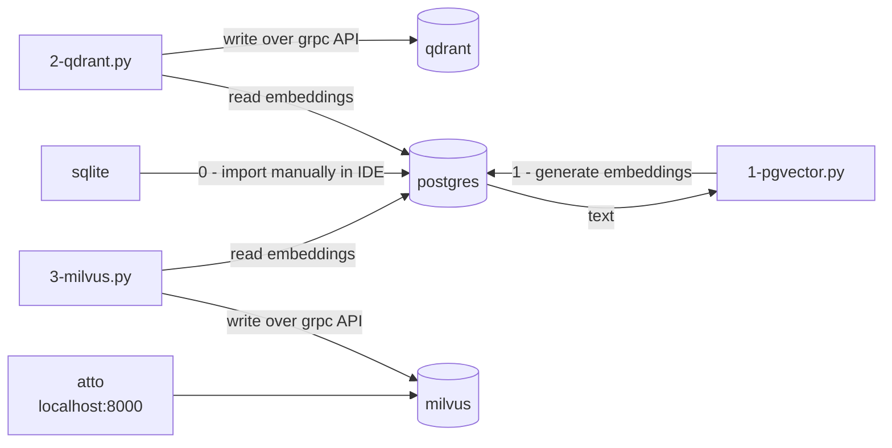

## Vector DBs comparison sandbox on a Biblical multilingual 10M verses

Goal of this repo is to compare different vector databases in terms of performance, load,
ease of use and features.


## Candidates

| Engine                                                                 | Ports      | URLs                                                 
|------------------------------------------------------------------------|------------|----------------------------------------------------|
| Postgres 16.4 + [pgvector 0.7.4](https://github.com/pgvector/pgvector) | 5432       |
| [Qdrant 1.11.0](https://github.com/qdrant/qdrant)                      | 6333       | [UI](http://localhost:6333/dashboard#/collections) |
| [Milvus 2.4.8](https://github.com/milvus-io/milvus)                    | 9091 19530 | [UI](http://localhost:8000)
| [Weviate 1.24.22](https://github.com/weaviate/weaviate)                | 8080 50051 |
| [ChromaDB 0.5.4](https://github.com/chroma-core/chroma)                | 8000       |
| Redis                                                                  | 6379       |
| Elastic                                                                |            |




### Testing Environment

- python 3.11
- local mac M3 32GB
- single-container dockerized vector databases


## Testing text data

Basic test is to load bible text data in different languages and compare search performance

### Data preparation
- Download SQLite data for bible in different languages
  https://bible.helloao.org/bible.db (8.4GB)
- Export `ChapterVerse` from SQLIte to Postgres for better performance. You will need some tool like IntelliJ DataGrip.
You could use sqlite but it would be very slow. 
- Add column `ChapterVerse.embedding` with `store.vector(768)` type
- Create index in postgres for faster updates
```
  create index ChapterVerse_translationid_bookid_chapternumber_number_index
    on store."ChapterVerse" (translationid, bookid, chapternumber, number);
  ```
- Pre-Generate embeddings and store them in same `ChapterVerse`. 
Use multilingual embed model with **768 dim**.
https://huggingface.co/sentence-transformers/paraphrase-multilingual-mpnet-base-v2

- Spin up vector database you want to test

```
# https://huggingface.co/sentence-transformers/paraphrase-multilingual-mpnet-base-v2
pip install -U sentence-transformers


# Generate embeddings into SQLite
# This will take a while
# You can re-run it to continue from where it stopped
python 0-generate-embeddings.py
```

### 1. Postgres + pgvector
Was unable to install pgvector on Postgres 14 and 15, so used Postgres 16.4

```
docker-compose -f docker-compose.pgvector.yml up postgres --build
python -m pip install "psycopg[binary]"
python 1-pgvector.py
```

Issues faced:
- could not install pgvector on Postgres 14 and 15
- faced `psycopg2.errors.UndefinedFunction: operator does not exist: text <-> vector` when installing extension because
operators were installed into public schema instead of `store`. 

#### How to visualize embeddings
You can use [cosmograph](https://cosmograph.app/run/)  online tool to visualize nodes and edges.

Export nodes into CSV:
```sql
SELECT
    CONCAT(translationid, '-', bookid,'-', chapternumber,'-',number) as id,
    text as label
FROM
    store."ChapterVerse"
WHERE
    embedding IS NOT NULL AND
    translationId='rus_syn' AND bookid IN ('JHN', 'LUK', 'MRK', 'MAT')
LIMIT 10000;
```

Export edges into CSV:
```sql
SET search_path TO store;
WITH pairwise_similarity AS (
    SELECT
        CONCAT(t1.translationid, '-', t1.bookid,'-', t1.chapternumber,'-',t1.number) AS source,
        CONCAT(t2.translationid, '-', t2.bookid,'-', t2.chapternumber,'-',t2.number)  AS target,
        (t1.embedding <=> t2.embedding) AS similarity
    FROM
        store."ChapterVerse" t1,
        store."ChapterVerse" t2
    WHERE
        t1.bookid IN ('JHN', 'LUK', 'MRK', 'MAT') AND
        t2.bookid IN ('JHN', 'LUK', 'MRK', 'MAT') AND
        t1.translationId='rus_syn' AND
        t2.translationId='rus_syn' AND
        t1.embedding IS NOT NULL AND
        t2.embedding IS NOT NULL AND
        CONCAT(t1.translationid, '-', t1.bookid,'-', t1.chapternumber,'-',t1.number) != CONCAT(t2.translationid, '-', t2.bookid,'-', t2.chapternumber,'-',t2.number)
)
SELECT
    source,
    target,
    similarity AS weight
FROM
    pairwise_similarity
WHERE
    similarity > 0.95
ORDER BY
    weight DESC
LIMIT 10000;

```


### 2. Qdrant
```
docker-compose -f docker-compose.qdrant.yml up qdrant

python -m pip install 'qdrant-client'

# Test Qdrant
python 2-qdrant.py
```

### 3. Milvus
```
python -m pip install pymilvus
docker-compose -f docker-compose.milvus.yml up
```

### Others
```bash
docker-compose -f docker-compose.weaviate.yml up weaviate
docker-compose -f docker-compose.chromadb.yml up
```

## Results
Most of time is spent on embedding generation

| Engine | Details  | Insert 10M, batch 100 | Search top 10 | Search with filter|
|--------|----------|-----------------------|---------------|--|
| Qdrant | Cosine,  | 786 sec (no wait)     | 0.214 sec     |--|
